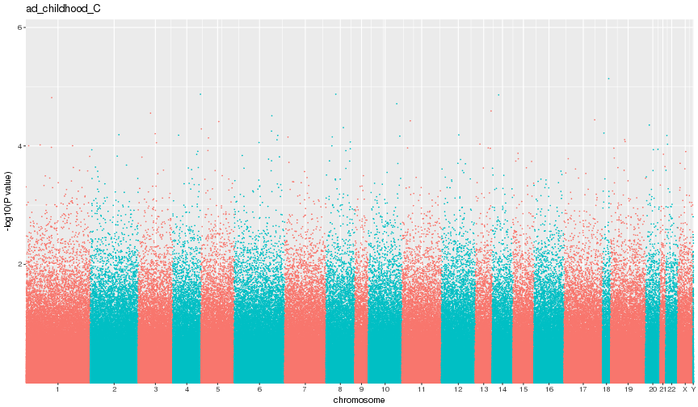
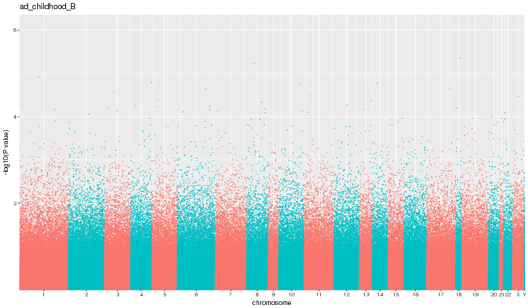
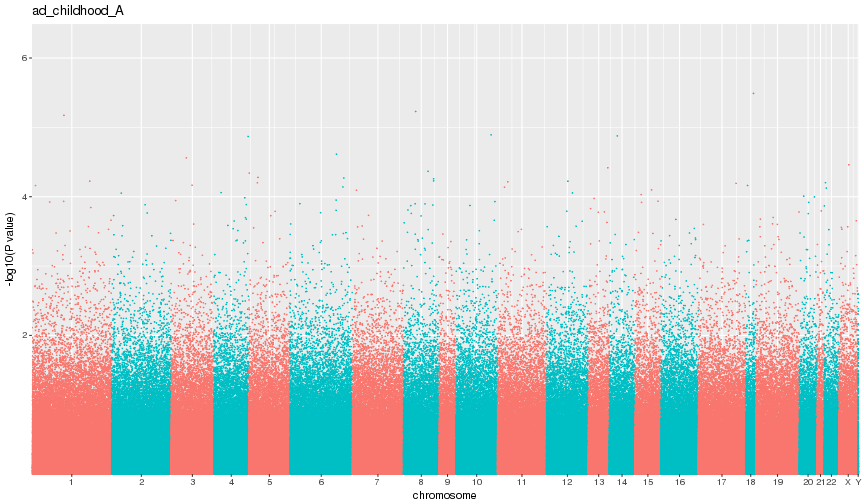
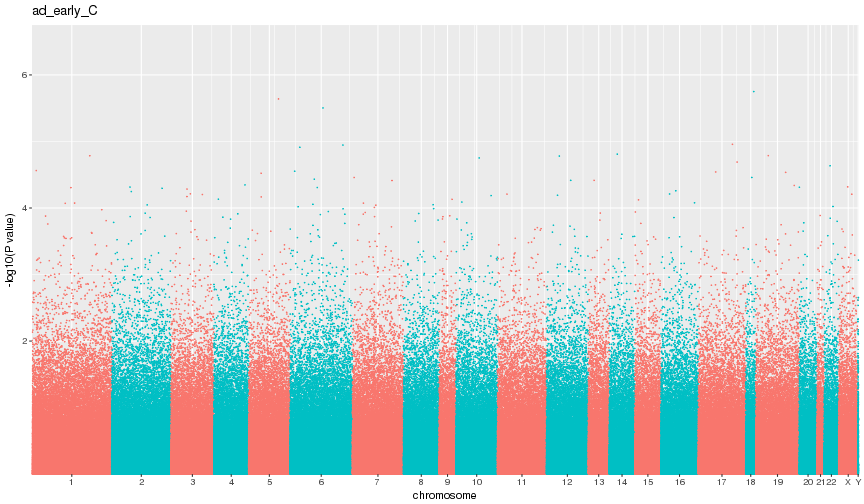
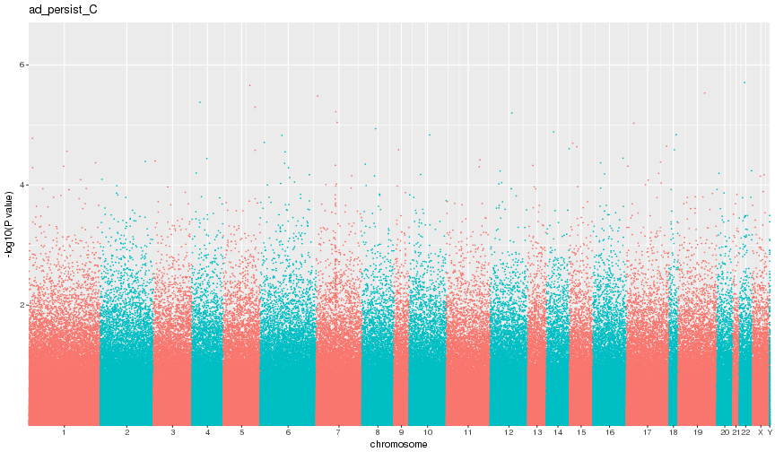
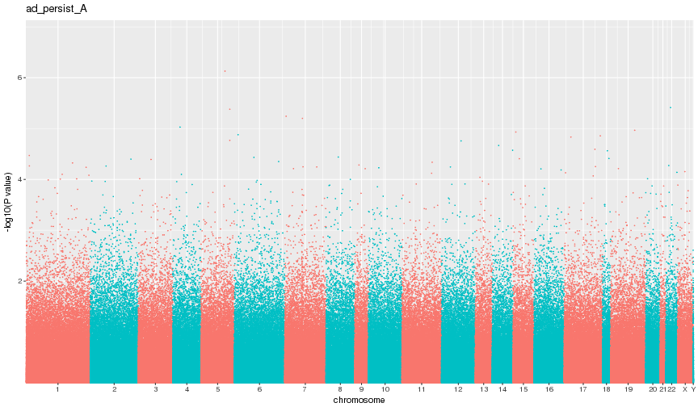

# PACE atopic dermatitis study

## Aim:
To examine the association between DNA methylation and atopic dermatitis (AD) in early life

## Methods
* __Sample__: Danish individuals of a random subset of the GOYA cohort (N = 517). AD data was gathered at 7 years of age.
* __Tissue__: Cord blood (450k data)
* __Outcome definitions__:
	+ Childhood AD = A doctor has at some point said that the child has eczema/allergic rash, and this rash has been active within the last twelve months __OR__ The child has had an itchy rash within the last twelve months, and this rash has affected one of the following places: the folds of the elbows, behind the knees, in front of the ankles, under the buttocks, or around the neck, ears or eyes __OR__ The child has had either doctor diagnosed AD or rash as described in (2), but not active within the last 12 months.
	+ Early AD = A doctor has diagnosed the child with eczema/allergic rash that occurred before 2 years of age
	+ Persistant AD = A doctor has diagnosed the child with eczema/allergic rash before 2 years of age, and this rash has been active within the last twelve months
* __Models__:
	+ A. AD ~ methylation + sex + SVs

	+ B. AD ~ methylation + sex + SVs + maternal age + maternal smoking in pregnancy + maternal SES + gestational age

	+ C. AD ~ methylation + sex + SVs + maternal age + maternal smoking in pregnancy + maternal SES + gestational age + cell count (bakulski)

### Summary of data

|                                                      |Overall      |no_ad_early  |ad_early     |no_ad_childhood |ad_childhood |no_ad_persist |ad_persist   |
|:-----------------------------------------------------|:------------|:------------|:------------|:---------------|:------------|:-------------|:------------|
|n                                                     |517          |478          |39           |424             |93           |484           |33           |
|male = 1 (%)                                          |260 (50.3)   |244 (51.0)   |16 (41.0)    |219 (51.7)      |41 (44.1)    |246 (50.8)    |14 (42.4)    |
|ga_weeks (mean (sd))                                  |40.22 (1.42) |40.23 (1.42) |40.12 (1.37) |40.27 (1.42)    |40.03 (1.40) |40.23 (1.42)  |40.22 (1.40) |
|m_smoke_pregnancy3 (%)                                |             |             |             |                |             |              |             |
|never_smoked                                          |405 (78.3)   |375 (78.5)   |30 (76.9)    |331 (78.1)      |74 (79.6)    |380 (78.5)    |25 (75.8)    |
|smoked_early                                          |40 (7.7)     |36 (7.5)     |4 (10.3)     |34 (8.0)        |6 (6.5)      |36 (7.4)      |4 (12.1)     |
|smoked_throughout                                     |72 (13.9)    |67 (14.0)    |5 (12.8)     |59 (13.9)       |13 (14.0)    |68 (14.0)     |4 (12.1)     |
|m_ses (%)                                             |             |             |             |                |             |              |             |
|1.manager/long or medium education                    |293 (56.7)   |265 (55.4)   |28 (71.8)    |235 (55.4)      |58 (62.4)    |270 (55.8)    |23 (69.7)    |
|2.work requiring a shorter training or skilled manual |175 (33.8)   |168 (35.1)   |7 (17.9)     |149 (35.1)      |26 (28.0)    |168 (34.7)    |7 (21.2)     |
|3.unskilled or public service                         |49 (9.5)     |45 (9.4)     |4 (10.3)     |40 (9.4)        |9 (9.7)      |46 (9.5)      |3 (9.1)      |
|m_age (mean (sd))                                     |29.98 (4.10) |30.05 (4.08) |29.22 (4.38) |30.04 (4.16)    |29.71 (3.83) |30.02 (4.06)  |29.39 (4.70) |
|bcell (mean (sd))                                     |0.16 (0.04)  |0.16 (0.04)  |0.16 (0.04)  |0.16 (0.04)     |0.17 (0.05)  |0.16 (0.04)   |0.15 (0.03)  |
|cd4t (mean (sd))                                      |0.18 (0.06)  |0.18 (0.06)  |0.18 (0.06)  |0.18 (0.06)     |0.19 (0.07)  |0.18 (0.06)   |0.19 (0.06)  |
|cd8t (mean (sd))                                      |0.08 (0.04)  |0.08 (0.04)  |0.08 (0.03)  |0.09 (0.04)     |0.08 (0.04)  |0.08 (0.04)   |0.08 (0.04)  |
|gran (mean (sd))                                      |0.31 (0.11)  |0.31 (0.11)  |0.31 (0.12)  |0.31 (0.11)     |0.30 (0.11)  |0.31 (0.11)   |0.31 (0.12)  |
|mono (mean (sd))                                      |0.02 (0.02)  |0.02 (0.02)  |0.02 (0.01)  |0.02 (0.02)     |0.02 (0.02)  |0.02 (0.02)   |0.02 (0.02)  |
|nk (mean (sd))                                        |0.02 (0.03)  |0.02 (0.03)  |0.02 (0.04)  |0.02 (0.03)     |0.02 (0.03)  |0.02 (0.03)   |0.02 (0.03)  |
|nrbc (mean (sd))                                      |0.25 (0.14)  |0.25 (0.14)  |0.26 (0.15)  |0.25 (0.14)     |0.25 (0.15)  |0.25 (0.14)   |0.26 (0.15)  |

## Results

|model          |   n| cases|    lambda| hits_nom| hits_fdr| hits_bon|
|:--------------|---:|-----:|---------:|--------:|--------:|--------:|
|ad_childhood_C | 517|    93| 0.9876248|    23927|        0|        0|
|ad_childhood_B | 517|    93| 0.9734210|    23028|        0|        0|
|ad_childhood_A | 517|    93| 0.9684217|    22672|        0|        0|
|ad_early_C     | 517|    39| 1.0498738|    27318|        0|        0|
|ad_early_B     | 517|    39| 1.0042137|    24624|        0|        0|
|ad_early_A     | 517|    39| 0.9906213|    23965|        0|        0|
|ad_persist_C   | 517|    33| 1.0682394|    28234|        0|        0|
|ad_persist_B   | 517|    33| 1.0282893|    25937|        0|        0|
|ad_persist_A   | 517|    33| 1.0096182|    24816|        0|        0|

